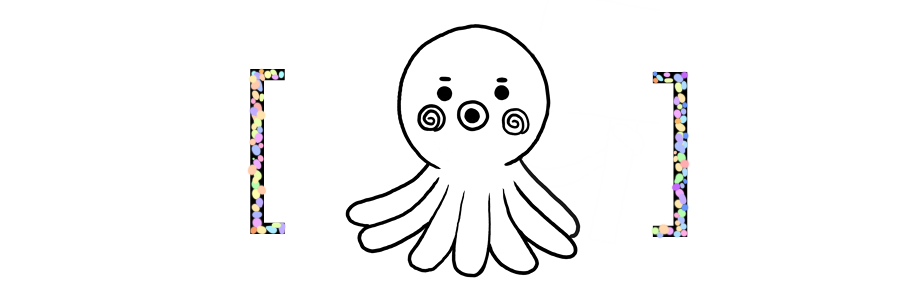

<!DOCTYPE html>
<html>
  <head>
      
  </head>
  <body>
          
<a href="https://github.com/myriarm/1.html">
          

</a>

          <input type="button" value="야간모드" onclick="
          document.querySelector('body'). style.backgroundColor='black';
          document.querySelector('body'). style.color='white';
          ">
          <input type="button" value="주간모드" onclick="
          document.querySelector('body'). style.backgroundColor='white';
          document.querySelector('body'). style.color='black';
          ">
          <input type="button" value="금지된 버튼" onclick="
          alert('지금 이 창을 닫으면 너는 궁금해 죽을 것이나, 탐색을 계속할 경우 너의 두 눈을 버리게 될 것이다.')">
           
          <input type="text" onchange="alert('')">
          <input type="button" value="검색" onclick="alert('내용을 입력하세요')">
          <ul class="navi">
                    <li class="navi_li"><a href="https://www.naver.com">소개| </a></li>
                    <li class="navi_li"><a href="https://www.naver.com">알림| </a></li>
                    <li class="navi_li"><a href="https://www.naver.com">정보| </a></li>
                    <li class="navi_li"><a href="https://www.naver.com">역대급| </a></li>
                    <li class="navi_li"><a href="https://www.naver.com">펌핑| </a></li>
          </ul>
  </body>
  </html>
